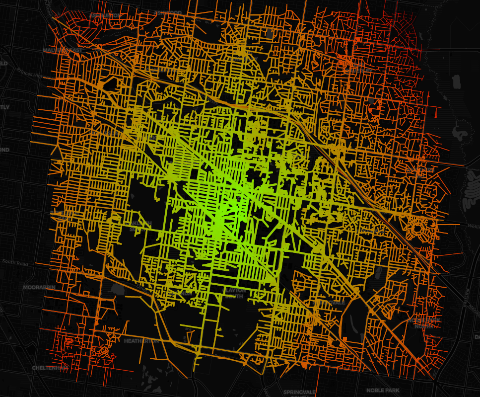

# GeospatialStroke

Repository of contributions for Frontiers in Neurology-Stroke journal,
focussing on geospatial analysis and transport.

## osmdata for Monash Medical Centre

A long-handed way to get the MMC polygon directly from Open Street Map
(because geocoding will only return a
    point)

``` r
library (osmdata)
```

    ## Data (c) OpenStreetMap contributors, ODbL 1.0. http://www.openstreetmap.org/copyright

``` r
amen <- opq ("Clayton Victoria") %>%
    add_osm_feature (key = "amenity", value = "hospital") %>%
    osmdata_sf () %>%
    magrittr::extract2 ("osm_polygons")
mmc <- amen$geometry [grep ("Monash Medical Centre", amen$name)]
```

Most `dodgr` functions work with simple WGS-84-projected values, rather
than `sf` objects, so the MMC can be converted to a numeric centroid
here:

``` r
mmc <- as.numeric (sf::st_centroid (mmc [[1]]))
```

## Distance chloropleth

Extracting the surrounding street network can then be done very simply
with the [`dodgr` package](https://github.com/ATFutures/dodgr). The
`expand` argument is a relative expansion, so the value of `expand = 1`
will **double** the size of the bounding box. (And there is currently no
way to do this in absolute terms, although that would be a nifty
enhancement.)

``` r
#library (dodgr)
devtools::load_all ("../../atfutures/dodgr", export_all = FALSE)
```

    ## Loading dodgr

``` r
dat <- dodgr_streetnet ("Clayton Victoria", expand = 1)
```

Then extract distances between the MMC centroid and all points of the
surrounding network. The `dodgr_contract_graph()` function contracts the
street network to junction nodes only, which makes these kinds of
calculations much faster.

``` r
graph <- weight_streetnet (dat, wt_profile = "motorcar")
nrow (graph)
```

    ## [1] 104027

``` r
graph <- dodgr_contract_graph (graph)$graph
nrow (graph)
```

    ## [1] 62017

``` r
verts <- dodgr_vertices (graph)
d <- dodgr_dists (graph = graph, from = mmc, to = verts)
```

These distances then need to be mapped back on to the street network to
generate the chloropleth. They all come with OSM identifiers (here, the
`colnames`). The distances are between network nodes, while the `graph`
object contains the edges. For each node, we therefore just need to find
an edge containing that node and allocate the corresponding distance.
Edges contain two nodes, as so we arbitrarily choose one of them by
taking the `min` value - equivalent to the first node - of the matching
pair.

``` r
indx <- cbind (match (graph$from_id, colnames (d)),
               match (graph$to_id, colnames (d)))
indx <- apply (indx, 1, function (i) min (i, na.rm = TRUE))
graph$dmmc <- d [indx]
```

## Visualistion

Visualising first requires conversion back to `sf` format:

``` r
graph_sfc <- dodgr_to_sfc (graph)
library (sf)
graph_sf <- st_sf (graph_sfc$dat, graph_sfc$geoms)
# not all nodes will necessarily be reachable on the network, so remove
# unreachable ones
graph_sf <- graph_sf [which (!is.na (graph_sf$dmmc)), ]
```

Then use `mapview` for a simple interactive visualisation (with
screenshot below).

``` r
library (mapview)
ncols <- 30
d <- graph_sf$dmmc / max (graph_sf$dmmc)
cols <- colorRampPalette (c ("lawngreen", "red")) (ncols) [ceiling (ncols * d)]
mapview (graph_sf, color = cols, lwd = 5 * (1 - d))
```


